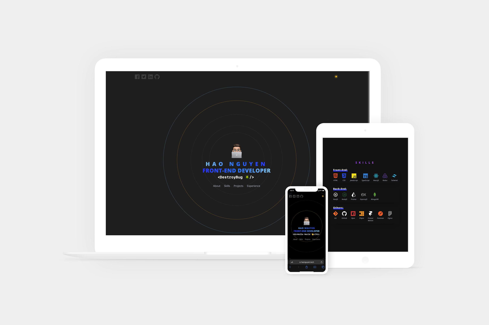

# Hao Nguyen's Personal Portfolio Website

## Motivation

This project is created as a chance for me to showcase my projects as a Web developers and also a chance for me to practice some cool technologies I haven't used before such as: Framer Motion, SparkPost and Sanity IO

Thank you Sonny Sangha for the inspiration. Check out his video [here](https://www.youtube.com/watch?v=urgi2iz9P6U)

## Description

Fully responsive with some cool animations personal portfolio website.
Built with:

Technologies:

* NextJS
* Typescript
* ReactJS
* TailwindCSS
* Framer Motion
* React - Query / Tan Stack
* Sanity IO
* SpartPost
* zod

---
The Project is built mainly use NextJS with ReactJS together with animation from Framer Motion and CSS is done by TailwindCSS.
Thanks to NextJS Server Side Rendering or in this case incremental static regeneration the page is prebuilt on the server and will helps a lot in loading time for the visitor

Sanity IO provided a CMS system that I used in the `Projects` section and the `Skills` section. In the future if I can easily update these section if needed

Framer Motion is used for cool animation of the pages. Even though it quite heavy, but I'm looking into reduce the JavaScript bundle with their `LazyMotion`

There is also a api end point `/api/contact-me` together with `SparkPost` to handle sending email from the `Contact` form to my personal email. The form is validate from the front end with `react-hook-forms` and validate again on the server with `zod`

### Challenges

The Framer Motion can cause some weird layout shift if not using carefully so using the `initial` with `opacity:0` and for example `x:200` it might cause layout shift when the component is in the viewport, since technically when that component is mounted the has the initial position of `x:200` but since we set `opacity:0` visually, we cannot see that.

If there is an Image component exist in the viewport when user first load the page, in my case is the Apple Animoji avatar in the Hero section, the loading time for 3G or slow 4G time in Mobile is not that good.

That's why I have been able to get quite good result for Lighthouse test on Desktop but not that good on Slow Mobile. Also factoring in the heavy JS bundle that Framer motion might cause.
